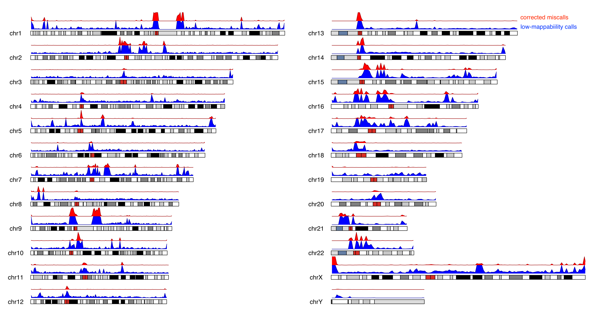

# low_bismap_methyl_calls: Correcting Methylation Calls in Low-Mappability Regions
Tools to assess called methylation in low mappability regions (as defined by bismap). Aligner MapQ does not always correspond with low mappability.

For the Nextflow pipeline used to examine the effectiveness of this method, see the workflow in miscalls_full.nf, and the workflows it imports from miscalls_pair.nf and miscalls_one.nf
